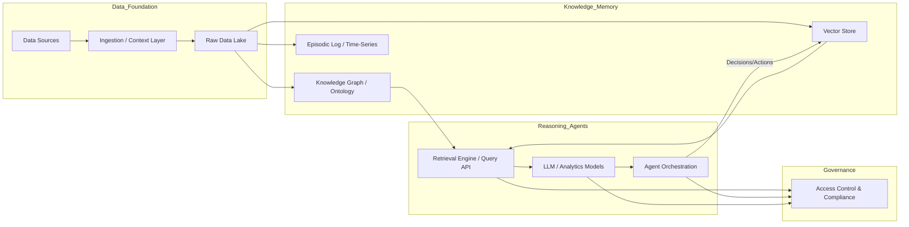
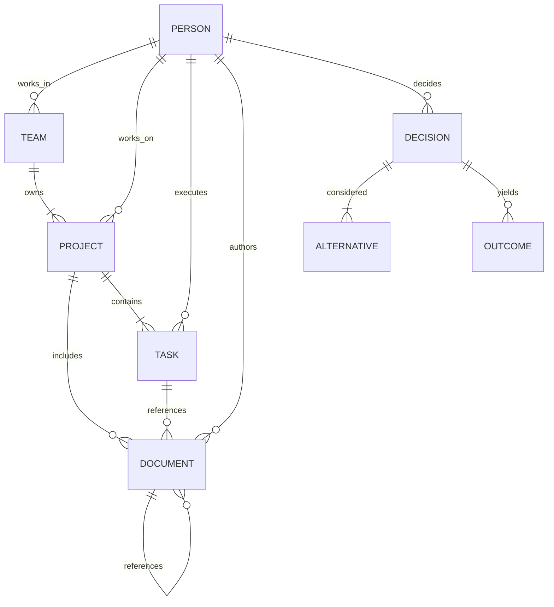
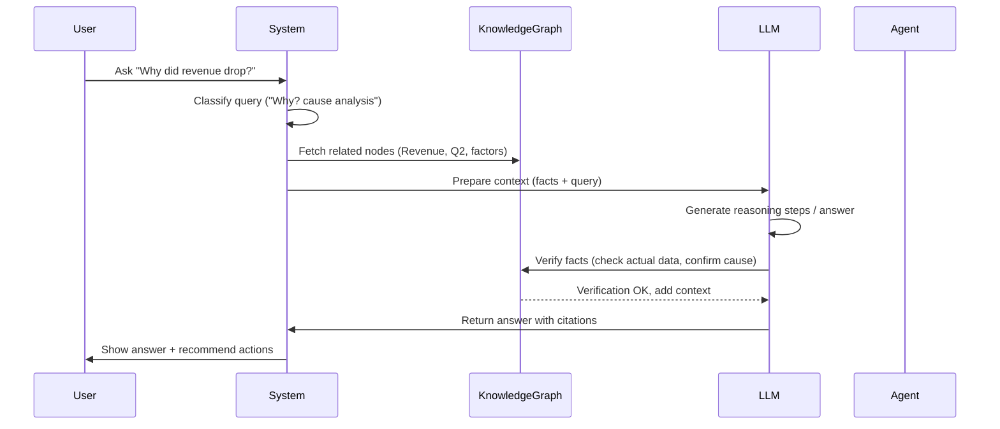

# Executive Summary

Building a “Company Brain” or full-stack **Organizational Operating System** means more than a search engine on corporate data. It requires layering **memory**, **knowledge**, **decision logic**, and **agents** around the organization’s data and people.  Modern enterprises (the **“Intelligent Digital Brain”**) must unify **data**, **context**, and **decision logic** into a continuously learning system.  The next competitive moat is not raw data (everybody has that) but **proprietary context** and institutional memory.  In practice, an intelligent OS should sense *what is happening*, interpret *what it means*, and help *respond at the right moment*.  This report outlines a full-stack architecture covering:

- **System architecture:** layered components (data foundation, ontology, models, agents, governance) and their responsibilities.  
- **Data flow and ingestion:** connectors, normalization, ontology mapping, truth hierarchy and continuous synchronization vs. one-off ETL.  
- **Memory taxonomy:** short-term (episodic/session), long-term semantic, procedural, social, strategic memory – and where each is stored (vector DB, graph DB, time-series, archives).  
- **Knowledge graph and ontology:** core entity types (People, Teams, Projects, Documents, Decisions, etc.) and relationship schema (reports_to, part_of, depends_on, triggered_by, etc.), with an ER diagram and table of node/edge types.  
- **Response architecture:** how a query is classified and routed, context retrieved (KG and embeddings), verified, and answered or acted upon (multi-step orchestration).  
- **Agent orchestration:** multi-agent pattern (session, harness, sandbox) with human-in-loop and safety (decoupling brain from hands, as in Anthropic’s managed agents).  
- **Decision capture:** structured decision records (context, alternatives, rationale, outcome) linked into memory and KG, enabling traceability and learning.  
- **Trust and truth:** policies for source authority (e.g. ERP/CRM vs. chat logs), conflict resolution (trust scores, lineage), and “point-in-time” semantics (bi-temporal modelling as in causal graphs).  
- **Security & governance:** RBAC/ABAC access controls, encryption, audit logging, identity integration (SSO/OAuth), compliance checks (GDPR, HIPAA etc.), and responsible-AI practices.  
- **Metrics & monitoring:** evaluating answer accuracy, decision quality (impact metrics), drift, user feedback, plus A/B testing plans and ROI tracking.  
- **Roadmap:** phased evolution from an MVP **knowledge assistant** (document search + Q&A) through “Context Brain” and “Decision Brain” to an **Autonomous Organizational OS**. Each phase has concrete deliverables, milestones and estimated effort.  
- **Technology stack:** recommended open-source and managed tools (vector DBs, graph databases, LLMs, orchestration frameworks, etc.) with cost/scale trade-offs.  
- **APIs & schemas:** sample JSON contracts for ingestion events, memory entries, decision records and query-response format.  
- **Risks & ethics:** analysis of biases, privacy concerns, ethical guardrails, and a governance checklist (data classification, bias audits, oversight).  
- **References:** key research papers, industry articles and primary sources that underpin each component.  

Altogether, this architecture is an **interdisciplinary synthesis** – drawing from AI, cognitive science (memory models), knowledge management, organizational behavior, and decision theory – to create a living **organizational intelligence** system.

## 1. System Architecture Overview

An Organizational OS can be visualized in layered components (see diagram below). At a high level, data flows in from enterprise systems into a **context/data foundation**; a **Knowledge Layer** (ontology/graphs, vector store) encodes the organization’s structure and facts; a **Reasoning/Model Layer** (LLMs, ML models, rule engines) does inference; **Agents/Orchestrator** execute tasks or coordinate workflows; and a **Governance Layer** ensures security, audit, and learning. 



- **Data Foundations:** All systems of record (databases, CRM, ERP, BI dashboards, emails, documents, chats) feed into a unified layer. We use live data virtualization or streaming (event-driven sync) rather than static copies. This provides an up-to-date “single source of truth” foundation.  

- **Knowledge & Memory Layer:** On top of raw data, we maintain a *Knowledge Graph (KG)/Ontology* of core entities (people, projects, documents, decisions, etc.) and their relationships. We also index semantic vectors (embeddings) for free-text/latent retrieval. Memory consists of both the KG (structured knowledge) and stores of events/history (logs, time-series). 

- **Specialized Models:** A model orchestration layer (e.g. LangChain, Mistral’s LOOM) hosts LLMs and other AI models (predictions, optimizations). It selects from vendor or custom models based on accuracy, cost, latency. This is the “reasoning core” where generative answers and analyses are formulated.  

- **Agents and Orchestration:** Autonomous *agents* (software robots) operate as the “active neurons”. Each agent has a dedicated session log and can call tools/sandboxes. The **Managed Agents** design (as in Anthropic) decouples the agent’s “brain” (LLM+reasoning) from its “hands” (execution environment). A central orchestrator coordinates multiple agents (for parallel tasks) and interfaces with humans via dashboards or approvals.

- **Governance & AI Lifecycle:** A cross-cutting layer manages policies, monitoring and compliance. It enforces RBAC/ABAC, audits all queries/changes, and handles model lifecycle (validation, retraining, retirement) with responsible-AI practices. 

Together, these layers form a **continuous intelligence system**: new data updates the KG and memory; agents query the KG plus LLMs to make decisions; outcomes are fed back as new knowledge. Over time, the system **learns from outcomes**, simulating future scenarios (as in a “living system”) to improve decisions.

## 2. Data Ingestion and Integration Pipeline

The ingestion pipeline is the entry point for all company data. It must connect to a wide variety of sources:

- **Structured Systems:** Databases (SQL/NoSQL), ERP/CRM (e.g. SAP, Salesforce), HRMS, financial systems, BI platforms.
- **Semi-/Unstructured Repos:** Document stores (Google Drive, SharePoint, Confluence, Notion), email archives, code repositories (GitHub, GitLab).
- **Communication Channels:** Slack/MS Teams, support tickets, CRM notes.
- **Meetings & Events:** Calendar invites, transcripts (Zoom transcripts).
- **External Data:** News, web data (for industry/context).

### 2.1 Connector and ETL Architecture

A typical design uses an extraction layer with adapters for each system: e.g. APIs, ODBC/JDBC, webhooks, or change-data-capture streams. Key considerations:

- **Live sync vs Batch:** Whenever possible, use *streaming/event* approaches (e.g. database CDC, webhooks) to update the KG in real-time. Avoid one-off dumps that quickly go stale.  
- **Schema & Entity Mapping:** Map each source schema to the organizational ontology. Example: Salesforce “Opportunity” → KG entity type **Deal**, Google Calendar event → **Meeting**, JIRA issue → **Task**. A metadata catalog or data fabric (e.g. Atlan, Collibra) can help maintain these mappings.  
- **Chunking & Context:** Rather than naive chunking of documents, preserve structure and lineage. E.g. ingest a Notion page as one object with hierarchy metadata, not as disjoint text chunks. This keeps context (author, project tags, update time) intact.  
- **Deduplication & Identity Resolution:** Before storing, resolve whether two records refer to the same real-world entity (e.g. `customer_id` vs `account_number`). Use canonical IDs and data lineage.  
- **Metadata & Sensitivity:** Tag ingested content with metadata: source system, last-updated, data steward, plus sensitivity labels (PII, confidential, public). This supports downstream trust evaluation and access control.

A visualization of pipeline vs modern “context layer” architecture (inspired by Atlan) helps:

| Pipeline Stage        | Traditional ETL Approach             | Context Layer Approach          |
|-----------------------|--------------------------------------|----------------------------------------------|
| Extraction            | Periodic dumps/ETL jobs (stale data) | Live sync (CDC) - the system maintains current state |
| Structure             | Split into text chunks (loses lineage) | Native objects (no chunking needed)   |
| Embedding/Indexing    | Vector similarity only               | Graph-based entity resolution before retrieval |
| Storage               | Vector DB + (optional) KG           | **Enterprise Data Graph** (governed, indexed)  |
| Freshness             | Scheduled refresh (gaps/staleness)   | Event-driven propagation (sub-second updates) |
| Trust/Certification   | Not implemented                      | Ingests certified assets, deprecation flags, owners |

The **Context Layer** approach means we treat the organization’s data as a live graph: there is no single “copy” of each fact, but a continuously updated graph reflecting the current state. In practice, we may still maintain a *materialized* KG cache for query speed, but it is updated automatically by listening to data changes.

### 2.2 Truth Hierarchy and Conflict Resolution

When multiple sources contain overlapping or conflicting information, we apply a **source authority hierarchy**. For example: 

1. **Systems of Record** (ERP/Financial systems, official compliance registers) have highest trust.  
2. **Curated Knowledge** (documented policies, procedures, official manuals) are next.  
3. **Productivity Data** (wikis, design docs, project trackers).  
4. **User-Generated Communications** (Slack, emails, meeting notes).  

Ingested data carries a provenance tag; if two records contradict (e.g. Notion says “Feature A launched June 10”, Slack says “launch delayed”), we flag a conflict. An automated rule might choose the higher-authority source or check timestamps; ambiguous cases route to human review. This mimics how organizations naturally trust ERP vs. a casual note. The system should **never silent-pass** a conflict – it should either resolve by rule or notify stakeholders. 

### 2.3 Data Normalization and Metadata

Normalize fields (dates, currencies, units) to common formats. Build a unified taxonomy/ontology layer that defines entity types and attributes (see Section 4). Attach rich metadata to each ingested item:

- **Entity tags:** Which KG entities (projects, customers, processes) this record is about.  
- **Sensitivity labels:** Classification (e.g. Public, Internal, Confidential, Restricted) often automatically detected.  
- **Ownership:** Who is responsible or the author.  

This metadata enables fine-grained retrieval later (e.g. “find all *non-confidential* meeting notes about Project X”).

## 3. Memory Architecture

The Company Brain maintains **multiple types of memory**, akin to human memory systems. Each type has its own storage and retrieval strategy:

- **Episodic Memory** *(Events & History)* – This records specific events and interactions (meeting transcripts, emails, support tickets, project milestones, chat logs). It is *time-stamped* and often unstructured. Storage: append-only log store or time-series DB (e.g. Elastic, InfluxDB, AWS Timestream) plus an archive of original transcripts. Retrieval: queries by time and participants; LLMs may ingest snippets. For example, “what did we discuss about X in last year’s weekly meetings?” could pull episodes.  
- **Semantic Memory** *(Facts & Knowledge)* – Factual organizational knowledge: product specs, policies, code definitions, org charts, customer profiles. Stored in **Knowledge Graphs** and document indexes. Retrieval: graph queries or embedding search with KG grounding. For example, the fact “Service Level Agreement = 99.9% uptime” would be a semantic memory item. 
- **Procedural Memory** *(Processes & Workflows)* – Knowledge of “how things get done”: onboarding checklists, SOPs, API call sequences, deployment pipelines. Can be modeled as workflow templates in the KG (nodes = steps, edges = next_action). Also stored as documents or structured procedures. Retrieval: e.g. “What’s the process to onboard a new vendor?” yields the procedure flow. 
- **Social Memory** *(People & Relationships)* – Who knows what and how people relate: org chart, team membership, subject-matter experts, social network traces (who interacts with whom). Stored as graph (Person nodes with edges like reports_to, works_with, follows). This enables queries like “Who is the expert on Kubernetes?” or “Who else frequently collaborates with Alice?” with trust in source (e.g. LinkedIn and internal directories as the truth). 
- **Strategic Memory** *(Vision & Goals)* – High-level intents: company vision, mission, OKRs, strategies, annual plans. Typically small in volume but high importance. Stored as key documents and graph nodes (e.g. an “Objective” entity linked to “Key Result” nodes). Retrieval: “What are our current top priorities?” yields the relevant goals and owners.

Each memory type may live in different storage: a document store or graph for semantic; a logging database for episodic; a relational DB for process templates; a graph DB also for social and strategic links. 

Critically, we distinguish **short-term / working memory** vs **long-term memory**. Conversation context and active reasoning traces belong to short-term (e.g. chat history, question threads) and can live in-memory or fast cache. The KG and archives form the *persistent memory*.

**Retrieval strategies:** We use **hybrid search**. For factual queries, graph traversals give precise answers (e.g. “Who manages Project Apollo?”). For open-ended or cross-domain queries, we use vector search over documents plus graph expansion. Often the LLM generates a sub-query graph walk (GraphRAG), e.g. “find entities similar to X then explore relationships”. We also use **re-ranking** or verifying LLM answers against the KG (fact-checking). 

（For example, with *GraphRAG*: first find nodes related by embedding similarity, then expand along edges; or start from a known node and traverse links, then LLM uses context from the union.） The result is an answer grounded in both text and structured facts.

## 4. Knowledge Graph and Organizational Ontology

A central knowledge graph (KG) encodes the company’s **ontology** – its fundamental entities and relationships. This acts as both memory and context provider. Below are **core node and edge types** (expandable to company needs):

| **Entity (Node)**       | **Description / Examples**                                               | **Relationships (Edges)**                                          |
|-------------------------|---------------------------------------------------------------------------|--------------------------------------------------------------------|
| **Person**              | Employees, contractors, executives                                        | *works_in*, *reports_to*, *participated_in*, *experts_in*, *knows* |
| **Team / Department**   | Organizational units (e.g. “Marketing”, “Engineering/Backend Team”)        | *manages*, *collaborates_with*, *owns*                             |
| **Role**                | Job titles/roles (“Product Manager”, “DevOps Engineer”)                   | *has_role*, *equivalent_to* (if synonyms)                          |
| **Project / Initiative**| Ongoing projects, programs, change initiatives                             | *has_owner*, *depends_on*, *includes*, *approved_by*              |
| **Task / Ticket**       | Specific work items (Jira ticket, task list entry)                        | *part_of_project*, *assigned_to*                                   |
| **Document**            | Reports, design docs, policy documents                                    | *authored_by*, *references*, *approved_by*, *version_of*          |
| **Decision**            | Formal decisions or approvals (see section 7)                              | *made_by*, *considers*, *affects*, *outcome*, *precedent_to*      |
| **Meeting / Event**     | Scheduled meetings, hackathons, workshops                                  | *attended_by*, *related_to_project*, *holds_decision*             |
| **Goal / OKR**         | Company objectives, key results, KPI definitions                           | *owned_by*, *aligned_to_strategy*, *tracked_by*                   |
| **Asset / Resource**    | Hardware, software licenses, budget items                                  | *allocated_to*, *used_by*                                          |
| **Customer / Partner**  | External entities (accounts, vendors, stakeholders)                        | *purchased*, *supports*, *contract_with*                           |
| **Process / Workflow**  | Named procedures or workflow templates                                    | *step_of*, *triggered_by*, *improves*                              |
| **Concept / Tag**       | Generic concepts for tagging (tech, subject)                              | *related_to*, *synonym_of*                                         |

Relationships capture how these connect. For example: 
- **Person – reports_to → Person** (org chart), 
- **Person – works_on → Project**, 
- **Project – uses → Asset**, 
- **Document – references → Document**, 
- **Decision – affects → Project**, 
- **Decision – made_by → Person/Team**, 
- **Person – collaborated_with → Person** (implicit through projects). 
Time is also first-class: edges can have attributes like `timestamp` (when a relation was true). The graph is actually **bi-temporal**: we record both valid time and transaction time so we can query the state of the graph at any past point.



*Example:* **Alice (Person)** `works_in` **Engineering (Team)**; Alice `assigned_to` **JIRA-123 (Task)** which is `part_of` **Project Phoenix**; the `delivery_approved` **Decision** was `made_by` **VP Engineering** and `affects` **Project Phoenix**; **Document Alpha** (a design doc) `authored_by` Alice and `references` **Document Beta** (requirements).

**Graph Population:** The KG can be initially bootstrapped from known sources (org chart CSV, project database, Confluence pages) and then continuously enriched via extraction/agents. Agents parsing a meeting transcript can add new edges (“Alice discussed X with Bob” → create `Person-Alice collaborated_with Bob`). 

**Entity Resolution:** Multiple source systems may have overlapping entities. The KG resolves identities (e.g. CRM “J. Doe” vs HRMS “John Doe”) to a canonical node using a probabilistic match or unique IDs (SSO/HRID).  

**Ontology Management:** Ontology evolves over time. We version entity schemas and allow schema migration. New classes (e.g. “Sprint” or “Milestone”) can be added. Use OWL/RDFS or simple JSON Schema for definitions. Tools like Neo4j or AWS Neptune can host the KG, or a triplestore (RDF) if inference is needed.  

## 5. Query/Response Architecture

When a user (or system) asks a question, the **Response Pipeline** typically follows these steps:

1. **Classification / Intent Detection:** A lightweight classifier determines query type (e.g. “Who?”, “What?”, “How?”, or system command). It may detect urgency, domain, or policy compliance (e.g. “Is this request allowed?”).  
2. **Routing:** Based on intent, route to appropriate subsystem: a knowledge Q&A agent, a search query, a planning agent, or direct action. For example, a query about *personnel* goes to the HR knowledge base; a *financial* question goes to a budget model.  
3. **Semantic Enrichment:** The query is embedded (vectorized) and/or parsed into KG query terms. LLMs may rewrite or expand queries (e.g. retrieving aliases from the ontology).  
4. **Retrieval:** The system fetches relevant context:
   - **KG Lookup:** If the query references known entities, we fetch their nodes/edges (e.g. “Jane’s manager”).  
   - **Hybrid Search:** Perform vector similarity search on docs and combine with graph traversal (GraphRAG). For instance, find documents about “Project X budget” then connect to the budget nodes in the KG.  
   - **Episodic Logs:** Time-based queries pull relevant events (“Find last meeting where Charlie mentioned deadline”).  
   - **Tool Outputs:** If needed, query a database or run a predictive model.  

5. **Answer Generation:** Using the combined context (text snippets + retrieved facts), an LLM or rule engine formulates an answer. For factual queries, it synthesises a response citing the KG or doc facts. For complex requests, it may plan multiple steps (see next).  
6. **Verification / Fact-checking:** Before finalizing, the system verifies facts against the KG or rules. For example, if the LLM says “Revenue up 10%,” it checks the actual finance tables. It also applies business logic constraints (e.g. budget limits) to filter or flag answers.  
7. **Multi-Step Orchestration:** If the task is multi-hop (e.g. “Prepare a summary report of this quarter’s churn and suggest actions”), the agent may autonomously perform subtasks: run analytics, generate charts, and compile text. Each action is logged in the session (see Section 6).  
8. **Response Delivery:** The final answer is returned to the user, often with references (KG links or document excerpts) and suggested next steps. If an action was taken (e.g. “File a ticket”), the system confirms it.  

Sequence flow (simplified):



**Chat vs API:** For human-chat interfaces, this can be interactive. For programmatic APIs, the system returns JSON: e.g.  
```json
{
  "answer": "Revenue dropped 12% due to XYZ changes ...",
  "sources": ["FinReport_Q2", "Sales_Log_Q2"],
  "suggestions": ["Review Sales strategy", "Alert pricing team"],
  "actions": [{"type":"create_ticket", "summary":"Investigate revenue drop"}]
}
```

## 6. Agent Orchestration

Agents are autonomous programs guided by the brain. We use a **multi-agent architecture** with distinct roles (planning agent, research agent, execution agent, etc.). Each agent has: 

- A **Session Log** (append-only): records every prompt, tool call, and outcome. This decouples agent state from ephemeral context windows. 
- A **Harness**: the loop that sends prompts to an LLM and handles its responses (Anthropic calls this the harness). The harness may incorporate retrieval or invoke tools. 
- A **Sandbox**: a safe execution environment for any code/tools the agent calls (containers, function-as-service). Agents treat tools (databases, email API, dashboards) as black-box “executes.”

Key design (from Anthropic’s Managed Agents):
- **Decoupled Brain and Hands:** The LLM (“brain”) and its execution environment (“hands”) are separated by well-defined interfaces. The harness calls tools via a generic `execute(tool_name, input) → output`. If a container crashes, it is simply restarted (treated as *cattle*, not *pet*). 
- **Durable Session:** The session log lives outside the harness. The harness writes each action/event into a log (via `emitEvent(id, event)`). If the harness fails, a new one can load the log and resume from the last event (recovering context).  
- **Tool Security:** Tools (databases, APIs) run in isolated sandboxes with no direct access to credentials or the agent’s memory. For example, DB tokens stay in a secure vault and are only used by a proxy service on-demand. The agent can’t exfiltrate credentials by malicious code.  

For coordination:
- Agents register their capabilities (e.g. “data_analysis”, “email_sending”). A central **Orchestrator** routes tasks to the right agent or farm. For instance, a “marketing analysis” task goes to an agent with access to sales data and analytics tools.  
- **Human-in-the-Loop:** For high-risk actions (e.g. issuing refunds, public announcements), we require human approval. Agents create “action tickets” that appear in a dashboard. A human can review the agent’s reasoning trace and either approve or override.  

Agents can also spawn sub-agents. For example, a manager-agent might delegate the task “draft Q3 strategy” to a research-agent and a writing-agent. We may use service buses (Kafka, RabbitMQ) or Kubernetes orchestration for the messaging between agents.

## 7. Decision Capture and Provenance

Decisions are central knowledge. The system should treat each important decision as a first-class **Decision record** in the memory. A Decision record schema (JSON example): 

```json
{
  "decision_id": "DEC-2026-0067",
  "title": "Adopt Kubernetes for Prod",
  "made_by": "Engineering Steering Committee",
  "date": "2026-05-12T15:30Z",
  "context": ["High CPU usage", "Scaling issues in Q1"],
  "alternatives": ["Stick with AWS ECS", "Use GCP Cloud Run", "On-premises Kubernetes"],
  "chosen": "AWS ECS",
  "rationale": "AWS ECS met scaling needs with minimal ops change; on-prem was too slow.",
  "expected_outcome": "Reduce latency by 20% by Q3",
  "actual_outcome": "Latency reduced 22% by Q4",
  "impact": "Improved user satisfaction; WIP units saved",
  "linked_entities": ["Project-X", "Team-CloudOps"],
  "source_documents": ["MeetingNotes-2026-05-12", "PerformanceReport-Q1"]
}
```

This record is stored in the KG (a `Decision` node) and linked to the People, Projects, and Documents involved. Key elements captured:

- **Context & Rationale:** Why the decision was needed, evidence considered.
- **Alternatives:** Options weighed, each as a sub-node if needed.
- **Outcome:** What happened afterwards.
- **Feedback Loop:** The system should later check if *expected_outcome* was met, and annotate the record. If not, the decision log helps retroactive analysis.
- **Provenance:** All source docs, meeting transcripts, data charts used are referenced.

For each decision, agents and humans should fill out such a form. Over time, the Brain builds a *decision history*. This enables queries like: *“Have we faced a similar choice before? What happened?”*. In GraphRAG terms, we can do *Decision Precedent Search* by finding “similar” decision nodes (via text similarity on rationales or overlapping context) and reviewing their outcomes.

## 8. Trust, Truth, and Conflict Resolution Policies

Maintaining **trustworthy information** is essential. We implement several patterns:

- **Source Certificates:** Each knowledge item has a provenance record: who created it, when, and what its status is. For example, a financial figure from the ERP might carry an “audited” flag; a meeting note has “speaker attestations”. The engine **enforces** this on retrieval: if an LLM pulls data, it also attaches source trust.  
- **Versioning & Time Travel:** As shown in Section 4, the data graph is bi-temporal. We retain history of facts. A query can specify “as of date” to avoid hindsight bias and see what was *known then*.  
- **Conflict Detection:** Automated agents periodically scan for contradictory facts. If found (e.g. two documents cite different values for a KPI), they flag it as an unresolved conflict in the KG. Such conflicts can be surfaced in answers: “Note: multiple sources disagree on X.”  
- **Truth Scores:** We may assign confidence scores to facts based on source reliability and recency. For example, a transaction total from the DB is 100% trusted, whereas a figure from a Slack message is lower trust. When answering, the system can indicate confidence (like CoT with probability).  
- **Policy Rules:** Some facts shouldn’t conflict: e.g. “Employee must have one manager”. We encode such cardinality rules in the ontology and enforce them. Ingested data violating rules triggers alerts.  
- **Human Arbitration:** Ultimately, major conflicts might require manual resolution. The system can create a “data incident” ticket when important discrepancies emerge, assigning it to data stewards.

## 9. Security, Privacy, and Compliance

**Access Control:** Use industry-standard RBAC/ABAC. Each user’s identity (via SSO/OAuth2) maps to roles and attributes (department, clearance). The KG and data stores enforce row/field-level permissions. For instance, a finance clerk cannot query HR records. Attribute-based rules allow fine-grained policies (e.g. “only GDPR team can access EU personal data”).

**Encryption:** All data in transit and at rest is encrypted. Sensitive memory (e.g. medical records, credit info) is masked or tokenized in the KG, with strict decryption policies. Agents must authenticate for each API call; we use short-lived tokens.

**Audit Logging:** Every query and action is logged (who asked what, what sources were accessed, what answer was returned). We maintain an immutable audit trail for compliance. For example, if an agent took an action (sent an email), the log includes that decision with reasoning.

**Data Privacy:** Where needed, we anonymize or pseudonymize in analyses. For example, the Personal Graph might record “Action: accessed Customer X dashboard” but with X hashed. Differential privacy techniques can protect aggregate statistics.

**Compliance:** The system must respect legal constraints. E.g. an agent cannot export personal data outside regulated geographies. We integrate with a policy engine (Open Policy Agent, etc.) to enforce such rules dynamically.

**AI Governance:** Align with responsible-AI frameworks. Track model lineage and ensure all generative outputs are fair and auditable. Periodically test for bias. For example, if the Brain suggests candidates for promotion, a fairness check runs to ensure no demographic skew.

## 10. Evaluation Metrics and Monitoring

We treat this system as a product and measure:

- **Knowledge Recall & Precision:** Test how often the system finds the *correct* answer. E.g. maintain a QA test suite with known questions/answers from each domain. Track F1-score of retrieved facts vs human-annotated ground truth. 
- **Decision Impact:** Monitor how Brain recommendations affect outcomes: measure uplift in KPIs (e.g. % faster project delivery, cost savings) when teams follow Brain suggestions. Use AB tests or before/after comparisons. 
- **Drift and Freshness:** Track staleness: fraction of data older than X hours. Also drift in ML models: periodically validate accuracy.  
- **Usage Analytics:** Query volumes by department, average response time, session lengths. 
- **User Satisfaction:** Surveys or implicit signals (follow-up questions, correction rates) gauge quality. 
- **ROI Tracking:** Correlate adoption (e.g. percent of employees using the Brain weekly) with productivity improvements or decision improvements (e.g. error rate reduction). 
- **A/B Testing:** For major changes (new retrieval algorithm), we can shadow-test or A/B responses on subsets of queries to measure uplift. For example, test GraphRAG vs old RAG on “clarity” and “accuracy” via blind user scoring. 
- **Continuous Monitoring:** Real-time dashboards monitor system health (latency, errors, resource use). Alerts trigger on anomalies (e.g. agent error spikes, knowledge gaps).

## 11. Phased Roadmap

Building a full Org-OS is an ambitious multi-year endeavor. We recommend **iterative phases**:

1. **MVP – Knowledge Platform (3–6 months):** Basic data ingestion and document retrieval. Connect core sources (wiki, CRM, docs), build a simple KG (people, projects, docs). Implement keyword+vector search and a Q&A UI. Deliverable: “Ask anything” for static company data. *Effort:* small team (~3 engineers) building ETL and basic vector search (Weaviate/Pinecone+OpenAI/Claude) with minimal UI.  

2. **Context Brain (6–9 months):** Add richer organizational context. Onboard enterprise directories (org chart), Jira/Git (projects/tasks), Slack (channels as topics). Expand KG (teams, roles, tasks). Implement context-aware Q&A (“What’s my manager’s email?”). Introduce RBAC. Add simple retrieval of relevant persons or processes. *Effort:* expanded team (5–7), build KG (Neo4j), implement SSO/permissions.  

3. **Decision Brain (12 months):** Introduce decision capture. Develop interfaces for logging decisions as above. Integrate analytics (e.g. budget, performance metrics) into KG. Enable questions about *why* and *what next*. Add pattern learning (e.g. similar past decisions). Start building multi-step planning agents (e.g. “perform a market analysis”). *Effort:* 10+ engineers + data analysts, evolving data models, building first autonomous agents.  

4. **Organizational Brain (18–24 months):** Add process intelligence and predictive insights. Implement continuous monitoring of key metrics (KPIs, team velocity) and anomaly detection. Introduce strategic memory (OKRs, roadmaps). Enable simulation (“what-if” scenario planning). Enhance agents to recommend cross-team coordination. *Effort:* 15+ engineers + PhD researchers (for ML), advanced analytics.  

5. **Autonomous Organizational OS (24–36 months):** Fully integrate agents into workflows. Agents can proactively trigger actions (create tickets, schedule meetings) under human oversight. System automatically learns from outcomes, adjusts processes, and even integrates external ecosystem partners. *Effort:* large organization-level project, significant R&D.  

Each phase delivers increasing value and should be validated by users. We anticipate small pilot teams first, then enterprise rollout as the system proves itself.

## 12. Technology Stack and Cost Considerations

**Ingestion & Storage:** Airbyte or Fivetran (connectors); Apache NiFi or custom Python for specialized sources. Data Lake/Warehouse (Snowflake, AWS Redshift) as raw store.  

**Graph Database:** Neo4j or Amazon Neptune for KG, especially for complex queries and traversal. (Neo4j AuraDB or Neo4j Community with Kubernetes.) For RDF needs, Blazegraph or Stardog.  

**Vector Store:** Pinecone, Weaviate, or Milvus for embedding-based retrieval. Cohere or GPT-4o embeddings.  

**ML/LLMs:** OpenAI GPT-4o (cloud) or local Llama 3x models for LLM tasks; Anthropic Claude for safe agents. Fine-tuning via LangChain/Deloitte’s Retriever. Use Hugging Face for smaller models. For prediction models: TensorFlow/PyTorch with DataBricks or SageMaker.  

**Orchestration:** Kubernetes cluster for agent sandboxes. Apache Airflow for data pipelines. Message queue (Kafka/RabbitMQ) for event streaming.  

**UI & APIs:** FastAPI/Node.js for back-end APIs. A web app (React/Vue) for chat and dashboards. 

**Security:** OAuth2 (Keycloak or Okta) for SSO. Vault for secrets. Open Policy Agent for ABAC.  

**Monitoring:** Grafana/Prometheus for system metrics; ELK stack for logs; custom dashboards for QA metrics.

*Cost/Scale:* Use managed services where possible (e.g. Neo4j Aura, Pinecone) to reduce ops. Vector search can grow expensive – sharding by teams/projects. LLM API costs scale with usage; consider on-prem fine-tunes if heavy. Graph DB scales with node/edge count – partition by domain. Overall, start small and scale out selective parts as value justifies.

| Component         | Open-Source Option          | Managed Option   | Notes/Scale |
|-------------------|-----------------------------|------------------|-------------|
| Graph DB          | Neo4j Community, JanusGraph | Neo4j Aura       | Ensure encryption; scale clusters |
| Vector DB         | FAISS, Pinecone open-source | Pinecone, Weaviate Cloud | Monitor embedding drift |
| LLMs              | Llama, Mistral (on-prem)    | GPT-4o, Claude   | Hybrid: critical functions local LLM for cost control |
| Storage           | PostgreSQL, MongoDB         | Snowflake, BigQuery | Data Lake vs WD | 
| Orchestration     | Kubernetes, Airflow         | AWS Step Functions | Security boundary for agents |
| Integration/ETL   | Airbyte, Apache NiFi        | Fivetran, Azure Data Factory | Choose based on environment |
| RBAC/SSO          | Keycloak, Dex              | Okta, Azure AD | Sync with corporate directory |
| Deployment        | Docker+K8s on EC2/GCP       | EKS/GKE, Lambda/Azure Functions | Scale worker pools dynamically |

*Cost trade-offs:* Managed cloud services speed up development but can be costly at scale. Open-source saves licensing but requires ops and reliability engineering.

## 13. API Contracts and Data Schemas

Below are illustrative JSON schemas for key interactions.

### Ingestion Event (example from Slack)

```json
{
  "source": "slack",
  "team": "product-dev",
  "channel": "#general",
  "timestamp": "2026-06-05T09:12:34Z",
  "author": "user123",
  "message": "Reminder: Sprint planning tomorrow at 10am.",
  "metadata": {
    "project_tags": ["Sprint-42"],
    "sensitivity": "internal"
  }
}
```

### Memory Entry (semantic fact)

```json
{
  "id": "fact-0000123",
  "type": "CustomerProfile",
  "data": {
    "customer_name": "Acme Corp",
    "industry": "Manufacturing",
    "annual_revenue": 12000000,
    "trusted_since": "2022-01-10"
  },
  "embeddings": [0.123, -0.047, ...], 
  "source": "crm_db",
  "last_updated": "2026-06-01T12:00:00Z",
  "confidence": 0.95
}
```

### Decision Record

(As in Section 7 example – see above JSON.)

### Query-Response (API output)

```json
{
  "query": "Who is responsible for Project Phoenix?",
  "answer": "Project Phoenix is owned by the Software Engineering team; the project lead is Alice Zhang.",
  "sources": [
    {"type":"KG","id":"project-Phoenix","relation":"has_owner","target":"team-EngSW"},
    {"type":"Document","id":"proj-Phoenix-plan","fragment":"owned by Software Eng"}
  ],
  "confidence": 0.93,
  "follow_up": ["Show project timeline", "Contact project lead"]
}
```

Clients of the API consume structured JSON with fields for answer text, supporting evidence, action items, etc. 

## 14. Risks, Ethical Considerations, and Governance Checklist

Building an AI-driven Org-OS has significant risks:

- **Bias & Fairness:** Models could perpetuate historical biases (e.g. in hiring or approvals). Regular bias testing is needed. Mitigation: anonymize sensitive attributes during analysis; have diverse review.  
- **Privacy Leak:** Agents with broad access might accidentally expose personal or confidential info. Mitigation: strict RBAC, redact sensitive fields in responses, and review transcripts for leakage.  
- **Misinformation:** LLM hallucinations could cause wrong decisions. Mitigation: always verify key facts against authoritative data (KG or rules).  
- **Over-Automation:** Risk of agents taking harmful actions (e.g. mass emailing). Mitigation: enforce human approvals for impactful actions; throttle agent operations.  
- **Security Vulnerabilities:** Attackers may target the system to extract data or inject false data. Mitigation: vulnerability scanning, penetration tests, network segmentation, least-privilege permissions. Anthropic’s sandboxing pattern is instructive.

**Ethical Checklist:** 
- Does the system respect employee privacy and data-use agreements? 
- Are humans in control of automated decisions (“meaningful human oversight”)?  
- Is there transparency (audit trails of why the system gave an answer)?  
- Is usage equitable (no team gets left out)?  
- Has risk of job displacement been considered (agents should augment, not replace, human judgment)?

**Governance:** Implement an AI governance board comprising IT, legal, and business leaders. They review major model updates, data scope, and emergent behavior. Regular audits (annual or triggered by incidents) should check compliance with internal policies and laws (e.g. GDPR, SOX).  

## 15. References

This architecture draws on research and industry best practices: Accenture’s “Intelligent Digital Brain” framework, RelationalAI on knowledge-graph-centric AI, Anthropic’s Managed Agents decoupling, Atlán’s “Context Layer” guidance on data ingestion, Matih Labs’ “Context Graph” use of graph + temporal context, and organizational memory theory. These are supplemented by emerging academic work (e.g. Personize’s Governed Memory) and documented patterns in enterprise AI and governance. The architecture above synthesizes these insights into a cohesive full-stack design for an enterprise-grade, AI-driven Company Brain.