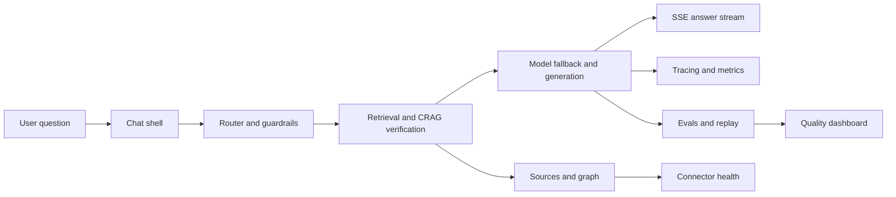

## Assest — Deep Audit & Implementation Plan

### Executive Summary

This document captures a deep audit of the Assest codebase (backend + frontend), enumerates observed runtime errors and bugs, lists the high-leverage improvements to make the system robust and production-ready, and provides concrete, file-level implementation plans and tests for each priority task.

Scope: inventory, LLM routing resiliency, SSE streaming correctness, observability, secrets hygiene, performance, and architecture docs.

---

### Skills & Tools to Use

- Diagnose: disciplined reproduce → minimize → hypothesise → instrument → fix → regression-test loop.
- TDD: add unit and integration tests (SSE streaming, LLM fallback, query lifecycle).
- Improve-Codebase-Architecture: refactors for centralised LLM routing and orchestration boundaries.
- Observability: Langfuse traces + Prometheus metrics + structured logs.
- Security/Secrets: secret scanning, `.env` hygiene, CI secrets store.
- Load & Perf: local load testing harness for SSE and Qdrant.

---

### Known Bugs / Runtime Errors (observed)

1. OpenRouter NotFoundError — "No endpoints found for <model>": root cause is configured `openrouter_smart_model` does not have endpoints on the account. Result: LLM calls 404 and no tokens are streamed.
2. Groq provider errors — `invalid_api_key` or `model_not_found` when calls were routed directly to Groq without a valid key or model access.
3. SSE UI silence — frontend only renders `type: "token"` SSE events; backend sometimes emits only `status` events on failure so the UI shows no assistant content.
4. Multiple provider codepaths — Groq, OpenRouter, and localized litellm proxy pathways exist; inconsistent handling caused divergent failures.
5. Secrets checked into `.env` in the repo — immediate security risk (rotate keys; remove from repo).

Example log snippets:

```
NotFoundError: No endpoints found for meta-llama/llama-3.1-8b-instruct:free
litellm: provider=openrouter model=openrouter/meta-llama/llama-3.1-8b-instruct:free
```

---

### High-Leverage Tasks (prioritised)

1. LLM Routing & Resilience (SharedLLMClient): fallback chain, retries, circuit breaker, startup model validation. (Effort: medium — 4–8h)
2. SSE Contract & Frontend Fallbacks: guarantee token emission and show `status` events in UI. Add SSE integration tests. (Effort: medium — 4–8h)
3. Secrets & Config Hygiene: remove secrets from VCS, add `.env.example`, startup validation, and CI secret injection. (Effort: small — 1–2h)
4. Observability & Tracing: wire Langfuse + Prometheus, add request correlation ids and metrics for LLM errors, SSE latency. (Effort: medium — 4–6h)
5. Integration Tests & CI: add unit and e2e for streaming queries using a mock LiteLLM proxy. (Effort: medium — 4–8h)
6. Docs & ADRs: capture routing decisions, SSE schema, fallback policies. (Effort: small — 1–2h)
7. Performance Tuning: Qdrant batching, worker pool tuning, and SSE throughput tests. (Effort: large — 8–16h)
8. Secure Deployment Checklist: docker-compose or k8s manifests, secrets management, and runbook. (Effort: medium — 4–8h)

---

### Implementation Details — Top Tasks

Task 1 — LLM Routing & Resilience

- Goal: centralised provider selection with deterministic fallbacks and fail-fast validation.
- Files to edit:
  - `backend/core/llm_impl.py` — implement fallback chain, retries, circuit breaker, structured logging.
  - `backend/core/config.py` — add `openrouter_fast_model`, `fallback_model_list`, and validation helpers.
  - `backend/reasoning/supervisor.py` — ensure uses `SharedLLMClient` and not raw SDKs.
  - `backend/__main__` or startup code — call `validate_models_on_startup()`.
- Key code changes:
  - Add `FallbackPolicy` class to hold ordered model list and retry/backoff parameters.
  - Add `CircuitBreaker` (simple count/time window) per provider.
  - On provider NotFound/NotAvailable error, attempt next model in fallback list with exponential backoff and jitter.
  - Add structured logs: include `request_id`, `provider`, `model`, `attempt`, `err`.
- Tests to add:
  - `tests/unit/test_llm_fallback.py` — mock `litellm` to throw NotFound on primary, assert fallback attempted and returned.
  - `tests/integration/test_llm_client_retry.py` — using a local mock server.
- Example patch summary:
  - Add `FallbackPolicy` and update `SharedLLMClient.chat_completion()` to attempt fallback models on NotFoundError. Add unit tests.

Task 2 — SSE Contract & Frontend Fallbacks

- Goal: ensure UI shows progressive assistant output or meaningful status/messages when LLM fails.
- Files to edit:
  - `backend/query/query_service.py` — ensure SSE stream always emits at least a token or useful assistant message; emit heartbeat/status events.
  - `web/src/app/chat/[id]/page.tsx` — expand SSE parser to accept `status`, `error`, and `token` event types; render them inline.
  - `tests/e2e/test_streaming.py` — add end-to-end test to assert tokens or status appear within a timeout.
- Key code changes:
  - Add SSE keepalive and structured event schema: `{type, text, metadata}`.
  - Add `status` rendering fallback and spinner states when no tokens within N seconds.
  - Add JS SSE reassembly for chunked tokens in the frontend reader.
- Tests to add:
  - SSE parser unit tests in frontend (Jest/Playwright) and backend SSE contract tests.

Task 3 — Secrets & Config Hygiene

- Goal: remove secrets from repo and enforce safe config patterns.
- Files to edit:
  - remove sensitive values from `.env` in repo and add `.env.example`.
  - `backend/core/config.py` — add stricter validation and helpful startup messages.
  - Add `.gitignore` entry for `.env` if not present.
- Steps:
  1. Rotate any keys found in `.env` (user action required).
  2. Commit `.env.example` with variable names and descriptions.
  3. Add pre-commit hook to detect secrets (e.g., `detect-secrets` or `git-secrets`).

### What The AI System Needs Before More Features

Before adding more surface area, the system needs these foundations so the app stays trustworthy and debuggable:

- **Evals** — offline scoring for correctness, faithfulness, completeness, and safety.
- **Tracing** — request-level and token-level traces tied to user, workspace, model, and retrieval context.
- **Routing** — one model router with fallbacks, retries, circuit breakers, and startup validation.
- **Guardrails** — input sanitization, PII handling, prompt-injection checks, and response policy checks.
- **Retrieval quality** — CRAG verification, source ranking, and confidence surfaced in the UI.
- **Connector health** — sync status, failures, and last successful ingestion visible per source.
- **Feedback loop** — thumbs-up/down, flagged answers, and replayable conversations for evals.
- **Deployability** — local/dev/prod parity, env validation, and metrics exposition.
- **Role awareness** — workspace-level permissions and audit logs for sensitive actions.

### Current Frontend Inventory

The current web app already has a usable base, but it is still mostly a chat-first shell:

- [web/src/components/AppShell.tsx](../../web/src/components/AppShell.tsx) wraps auth and the main shell.
- [web/src/components/Sidebar.tsx](../../web/src/components/Sidebar.tsx) shows nav and recent chats, but not analytics or ops controls.
- [web/src/app/page.tsx](../../web/src/app/page.tsx) is the entry chat composer with suggestion cards.
- [web/src/app/chat/[id]/page.tsx](../../web/src/app/chat/[id]/page.tsx) is the main interaction surface for answers and sources.
- [web/src/app/connectors/page.tsx](../../web/src/app/connectors/page.tsx) is the source management view.
- [web/src/components/GraphView.tsx](../../web/src/components/GraphView.tsx) is a static knowledge graph mock.
- [web/src/components/SourceCard.tsx](../../web/src/components/SourceCard.tsx) is a simple citation chip.
- [web/src/components/SourceSetupModal.tsx](../../web/src/components/SourceSetupModal.tsx) handles connector onboarding.

Gap summary: the app has chat and connector management, but it does not yet expose an observability cockpit, eval workflow, prompt/version history, or a compelling agent workspace.

### Design Direction Options

#### Option 1 — Intelligence Workspace

Best for an enterprise AI system that needs to surface ops, quality, and retrieval in one place.

- **Feel:** polished command center, high signal, serious but not sterile.
- **Layout:** three-pane workspace with chat on the left, reasoning/evals in the middle, and sources/traces on the right.
- **Hero feature:** live answer lifecycle with trace spans, citations, and eval status under the same question.
- **Why it fits:** strongest match for your requirements around evals, tracing, connector health, and source confidence.

#### Option 2 — Conversational Studio

Best for a more engaging and approachable first-time experience.

- **Feel:** warm, cinematic, slightly playful, with stronger motion and richer prompt cards.
- **Layout:** full-screen chat canvas with a floating context rail and expandable analysis drawer.
- **Hero feature:** prompt suggestions that morph into tasks, sources, and next actions.
- **Why it fits:** excellent for adoption and makes the system feel modern instead of like a standard admin dashboard.

#### Option 3 — Knowledge Command Deck

Best for teams that think in graphs, connectors, and operational state.

- **Feel:** graph-forward, systems-oriented, visually distinctive.
- **Layout:** network graph / connector topology center stage, with chat and evals orbiting around it.
- **Hero feature:** live graph of sources, embeddings, traces, and execution paths.
- **Why it fits:** strongest if you want the product to feel unique and very AI-system without looking generic.

### Recommended Choice

**Option 1 — Intelligence Workspace** is the strongest default for this project.

Reason: it balances engagement with the hard requirements of a production AI system. It gives us room to show evals, tracing, connector health, retrieval confidence, and conversational UX without making the interface feel overloaded.

### Recommended MCP / Skills Stack For The Design Phase

- **Figma MCP** — use for design concepts, layout exploration, and code-connect mapping once MCP access is available.
- **figma-use** — for building the chosen UI in Figma from existing primitives.
- **figma-generate-design** — for turning the live web app into a pixel reference if we decide to sync the current UI.
- **figma-code-connect** — for mapping Figma components back to [web/src/components](../../web/src/components) once the design direction is approved.
- **improve-codebase-architecture** — for identifying the deep seams to deepen instead of spreading more logic across the shell.
- **diagnose** — for runtime failures around routing, SSE, and connector sync.
- **tdd** — for evals, SSE contract tests, and model-router fallback tests.

### Suggested Next Implementation Slice

1. Ship startup validation + fallback routing so the system fails fast on bad model config.
2. Add SSE status/error events so the chat UI never goes silent.
3. Build the Intelligence Workspace shell with observability panels and connector health.
4. Add the first eval loop with a small curated answer set and score history.

### Architecture Shape For The Next Phase



---

### ADRs

  Key architecture decisions are documented as ADRs in `docs/architecture/`:

  - [ADR 001 — LLM Routing & Resilience](adr-001-llm-routing.md)
  - [ADR 002 — SSE Contract and Frontend Fallbacks](adr-002-sse-contract.md)
  - [ADR 003 — Observability: Metrics & Tracing](adr-003-observability.md)
  - [ADR 004 — Testing and CI for Streaming & LLM Resilience](adr-004-testing-ci.md)


---

### CI / Tests / Developer Experience

- Add a `tests/e2e` job that optionally spins up a mock LiteLLM proxy (a small Python HTTP server that streams SSE) and runs the streaming test.
- Add `pytest` markers for integration vs unit tests.
- Add pre-commit hooks: `black`, `ruff`, `detect-secrets`.

---

### Observability & Metrics

- Instrument LLM calls with Langfuse events and attach `request_id`, `model`, `provider`, `latency`, `error`.
- Add Prometheus counters:
  - `assest_llm_calls_total{provider,model,status}`
  - `assest_sse_tokens_total`
  - `assest_stream_latency_seconds` (histogram)
- Add Grafana dashboards for LLM error rates, SSE latencies, queue lengths, and worker utilization.

---

### Rollout Plan & Phases

Phase 0 — Safety
- Remove keys from repo, rotate compromised keys, add `.env.example`.

Phase 1 — Quick wins (1–2 days)
- Add startup validation for LLM models.
- Emit token fallbacks in SSE and update frontend to render `status` events.
- Add unit tests for routing and SSE contract.

Phase 2 — Resilience & Observability (2–5 days)
- Implement fallback lists, retries, circuit-breakers.
- Add Langfuse + metrics, structured logs, and CI integration tests.

Phase 3 — Performance & Scale (1–2 weeks)
- Load test SSE throughput, tune Qdrant writes, batch workers, and add caching layers as needed.

---

### Checklist (quick)

- [ ] Remove secrets from repo and rotate keys
- [ ] Add `.env.example`
- [ ] Add startup LLM model validation
- [ ] Implement fallback policy in `SharedLLMClient`
- [ ] Update SSE backend + frontend rendering and add integration tests
- [ ] Add Prometheus metrics and Langfuse tracing
- [ ] Add pre-commit secret scanning
- [ ] Document ADRs for routing and SSE contract

---

If you approve, I'll: (1) create `docs/architecture/inventory.md` with an automated code scan, (2) implement Task 1 (LLM routing resilience) behind a feature flag and unit tests, and (3) follow with SSE tests and frontend changes. Which step should I start implementing first? 
