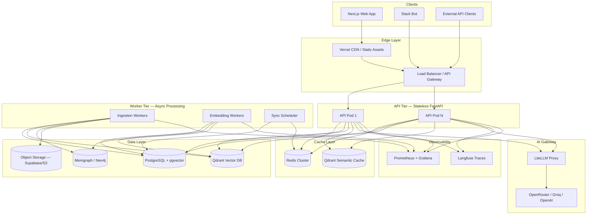
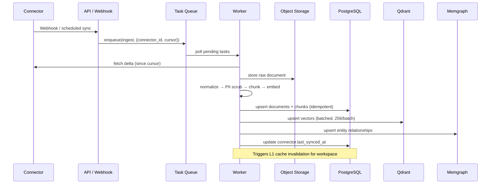
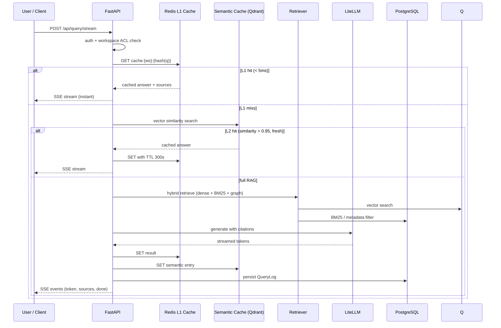
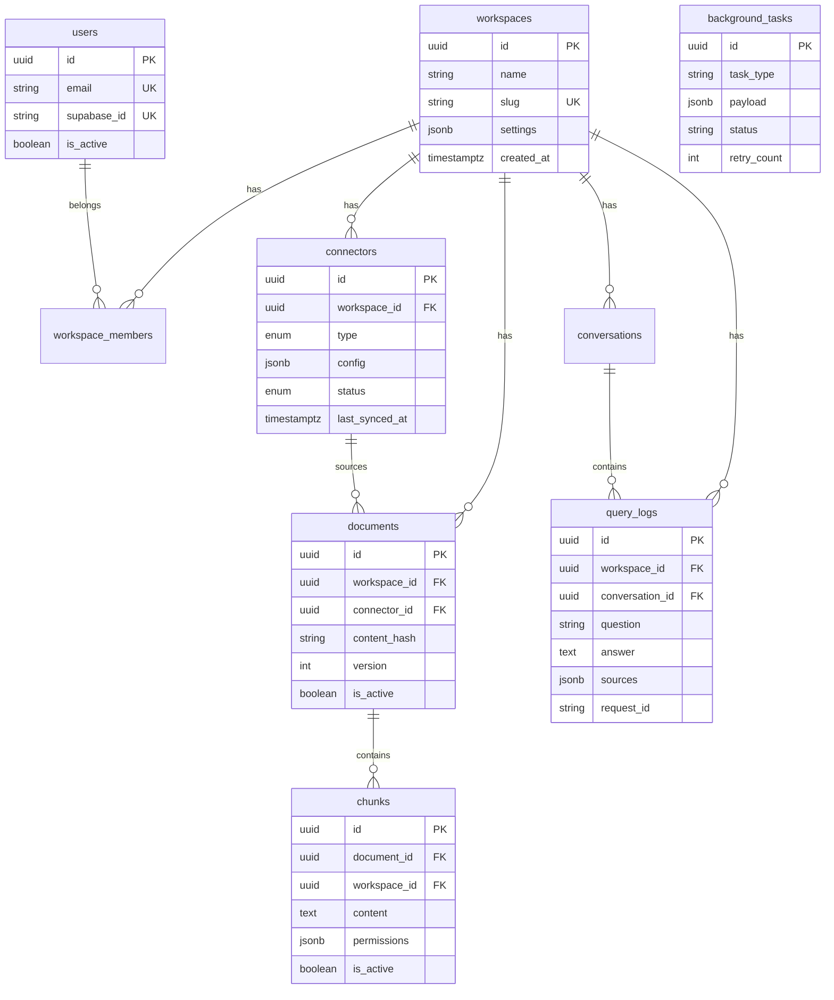

# Assest — Production System Architecture

> Scalable, multi-tenant knowledge platform for high-growth startups.
> This document defines the target production architecture and the minimal implementation path that ships today while scaling tomorrow.

---

## 1. System Architecture

Assest is a **horizontally scalable, event-driven RAG platform** with clear separation between the synchronous query path and the asynchronous ingestion path.



### Design Principles

| Principle | Implementation |
|-----------|----------------|
| **Stateless API** | All session state in Redis/Postgres; pods scale horizontally |
| **Async ingestion** | Connectors → task queue → worker pool; never block query path |
| **Multi-tenant isolation** | `workspace_id` on every row + ACL pre-filter at retrieval |
| **Graceful degradation** | Redis miss → semantic cache → full RAG; each tier optional |
| **Idempotent writes** | Content-hash dedup, idempotency keys on sync events |
| **Observable by default** | `request_id` propagated API → LLM → SSE → Langfuse |

### Deployment Topology (Production)

```
┌─────────────────────────────────────────────────────────────┐
│  Region: ap-south-1 (primary)                               │
│  ┌─────────────┐  ┌─────────────┐  ┌─────────────────────┐  │
│  │ Vercel Edge │  │ Fly.io /    │  │ Managed Workers     │  │
│  │ (Next.js)   │  │ ECS API x3  │  │ (ingestion pool x2) │  │
│  └─────────────┘  └─────────────┘  └─────────────────────┘  │
│  ┌─────────────┐  ┌─────────────┐  ┌─────────────────────┐  │
│  │ Supabase    │  │ Qdrant Cloud│  │ Upstash Redis       │  │
│  │ Postgres    │  │ (vectors)   │  │ (cache + rate limit)│  │
│  └─────────────┘  └─────────────┘  └─────────────────────┘  │
└─────────────────────────────────────────────────────────────┘
```

---

## 2. Component Structure

```
assert/
├── web/                          # Next.js frontend (Vercel)
│   └── src/app/                  # App Router, SSE chat consumer
│
├── backend/
│   ├── main.py                   # FastAPI entry, middleware, routers
│   ├── api/                      # HTTP handlers (thin controllers)
│   │   ├── query.py              # POST /api/query, /api/query/stream
│   │   ├── connectors.py         # Connector CRUD + sync triggers
│   │   ├── documents.py          # Upload + document metadata
│   │   └── health.py             # /health, /health/live, /metrics
│   │
│   ├── core/                     # Shared infrastructure
│   │   ├── config.py             # pydantic-settings (12-factor)
│   │   ├── database.py           # async SQLAlchemy + PgBouncer-safe pool
│   │   ├── redis_client.py       # Singleton Redis connection pool
│   │   ├── cache_service.py      # L1 Redis + L2 semantic cache
│   │   ├── lifecycle.py          # Startup/shutdown dependency warmup
│   │   ├── vector_store.py       # Qdrant client abstraction
│   │   └── llm_client.py         # LiteLLM routing + fallbacks
│   │
│   ├── query/                    # Synchronous query path
│   │   ├── query_service.py      # Orchestrator: route → retrieve → generate
│   │   ├── adaptive_router.py    # DIRECT / FAST_RAG / FULL_SWARM tiers
│   │   ├── retriever.py          # Hybrid dense + BM25 + graph
│   │   ├── semantic_cache.py     # L2 vector similarity cache (Qdrant)
│   │   └── generator.py          # Citation-grounded answer generation
│   │
│   ├── ingestion/                # Async ingestion pipeline
│   │   ├── runner.py             # Sync run coordinator
│   │   ├── document_store.py     # Canonical document persistence
│   │   ├── chunker.py            # Adaptive semantic chunking
│   │   └── embedder.py           # Embedding generation
│   │
│   ├── workers/                  # Background processing
│   │   ├── task_queue.py         # DB-backed task queue (→ Redis Streams at scale)
│   │   └── handlers.py           # Task type handlers
│   │
│   ├── connectors/               # Source adapters (Notion, Drive, Slack…)
│   ├── reasoning/                # Multi-agent LangGraph orchestration
│   ├── models/                   # SQLAlchemy ORM models
│   └── memory/                   # Episodic + Redis memory stores
│
├── infrastructure/
│   ├── docker-compose.yml        # Local dev stack
│   ├── docker-compose.prod.yml   # Production overlay
│   └── schema/001_core.sql       # PostgreSQL DDL (source of truth)
│
└── docs/architecture/            # ADRs + this document
```

### Service Boundaries

| Service | Responsibility | Scale Trigger |
|---------|---------------|---------------|
| **API** | Auth, query, SSE streaming, webhooks | p95 latency > 2s |
| **Worker** | Ingestion, embedding, connector sync | Queue depth > 100 |
| **Scheduler** | Periodic auto-sync cron | Connector count > 50 |
| **LiteLLM** | Model routing, rate limits, caching | Token budget exhaustion |

---

## 3. Data Flow

### 3.1 Ingestion Flow (Write Path)



### 3.2 Query Flow (Read Path)



### 3.3 Event Contract (SSE)

All streaming responses use Server-Sent Events with a stable JSON schema:

```json
{"type": "status",   "message": "Retrieving context...", "timestamp": "2026-06-20T12:00:00Z"}
{"type": "token",    "token": "The", "timestamp": "..."}
{"type": "sources",  "sources": [{"title": "...", "url": "..."}], "timestamp": "..."}
{"type": "done",     "query_id": "...", "conversation_id": "...", "timestamp": "..."}
```

---

## 4. API Design

### Versioning

- Current: `/api/*` (v1 implicit)
- Future: `/api/v2/*` with header `X-API-Version: 2`
- Breaking changes require new version; v1 maintained for 6 months

### Authentication

| Method | Header | Use Case |
|--------|--------|----------|
| Supabase JWT | `Authorization: Bearer <jwt>` | Web app users |
| API Key | `X-API-Key: <key>` | Server-to-server (future) |

### Core Endpoints

#### Query

```
POST /api/query
POST /api/query/stream          # SSE — preferred for UX
```

**Request:**
```json
{
  "question": "What is our refund policy?",
  "workspace_id": "ws_abc123",
  "conversation_id": "conv_xyz",       // optional — creates new if omitted
  "reasoning_mode": false,             // true → multi-agent swarm
  "context_files": ["doc_id_1"]        // optional scope filter
}
```

**Response (sync):**
```json
{
  "answer": "...",
  "sources": [{"title": "Refund Policy", "url": "https://..."}],
  "query_id": "q_123",
  "conversation_id": "conv_xyz"
}
```

**Headers (all endpoints):**
- `X-Request-ID` — client-supplied correlation ID (optional, server generates if absent)
- `X-Workspace-ID` — redundant with body; used for middleware ACL pre-check

#### Connectors

```
GET    /api/connectors?workspace_id=
POST   /api/connectors              # Create + OAuth redirect
POST   /api/connectors/{id}/sync    # Trigger manual sync
DELETE /api/connectors/{id}
```

#### Documents

```
POST   /api/documents/upload        # Multipart file upload
GET    /api/documents?workspace_id=
GET    /api/documents/{id}
```

#### Health & Ops

```
GET /health/live                    # K8s liveness (always 200)
GET /health                         # Readiness — checks all deps
GET /health/ready                   # Strict readiness (all deps required)
GET /metrics                        # Prometheus exposition
```

### Rate Limits

| Endpoint | Limit | Key |
|----------|-------|-----|
| `/api/query*` | 10/min | IP + user_id |
| `/api/connectors/*/sync` | 5/min | workspace_id |
| `/api/documents/upload` | 20/hr | workspace_id |

### Error Contract

```json
{
  "detail": "Human-readable message",
  "error_code": "WORKSPACE_ACCESS_DENIED",
  "request_id": "req_abc"
}
```

| HTTP | Code | Meaning |
|------|------|---------|
| 401 | `UNAUTHORIZED` | Missing/invalid JWT |
| 403 | `WORKSPACE_ACCESS_DENIED` | User not member of workspace |
| 429 | `RATE_LIMITED` | Slow down |
| 503 | `SERVICE_DEGRADED` | Dependency offline, retry |

---

## 5. Database Schema

PostgreSQL is the **system of record** for metadata, ACLs, audit, and task queue. Vectors live in Qdrant; graph edges in Memgraph.

### Entity Relationship (Core)



### Indexing Strategy

| Table | Index | Purpose |
|-------|-------|---------|
| `documents` | `(workspace_id, content_hash)` UNIQUE | Dedup on re-ingest |
| `chunks` | `(workspace_id, is_active)` | Active chunk filter |
| `chunks` | GIN on `to_tsvector('english', content)` | BM25 full-text |
| `query_logs` | `(workspace_id, created_at DESC)` | Analytics |
| `background_tasks` | `(status, created_at)` WHERE status='pending' | Worker poll |
| `connectors` | `(workspace_id, status)` | Scheduler scan |

### Migration Path

1. **Dev**: SQLite + SQLAlchemy `create_all()` + `ensure_sqlite_dev_columns()`
2. **Staging/Prod**: `infrastructure/schema/001_core.sql` applied via Flyway/Alembic
3. **Scale**: Read replicas for analytics queries; primary for writes

Full DDL: [`infrastructure/schema/001_core.sql`](../../infrastructure/schema/001_core.sql)

---

## 6. Caching Strategy

### Multi-Tier Cache Architecture

```
Request
   │
   ▼
┌─────────────────────────────────────┐
│  L1: Redis Hot Cache                │  TTL: 300s (5 min)
│  Key: cache:{workspace}:{sha256(q)} │  Hit latency: ~1-5ms
│  Invalidation: workspace sync event │
└──────────────┬──────────────────────┘
               │ miss
               ▼
┌─────────────────────────────────────┐
│  L2: Semantic Cache (Qdrant)        │  Threshold: cosine > 0.95
│  Collection: semantic_cache         │  Hit latency: ~20-50ms
│  Freshness: connector.last_synced_at│
└──────────────┬──────────────────────┘
               │ miss
               ▼
┌─────────────────────────────────────┐
│  L3: Full RAG Pipeline              │  Latency: 1-8s
│  Retrieve → CRAG → Generate         │
└─────────────────────────────────────┘
```

### Cache Key Design

```python
# L1 exact-match key
f"cache:v1:{workspace_id}:{sha256(normalized_question)}"

# L2 uses embedding vector — no explicit key; similarity search
```

### Invalidation Rules

| Event | Action |
|-------|--------|
| Connector sync completes | `DEL cache:v1:{workspace_id}:*` (pattern scan) |
| Document deleted | Purge L2 workspace collection + L1 pattern |
| Manual refresh | `POST /api/admin/cache/purge?workspace_id=` |

### What NOT to Cache

- Queries with `reasoning_mode=true` (non-deterministic multi-agent)
- Queries scoped to `context_files` (user-specific context)
- Answers with confidence < 0.7 (low-quality responses)

### Redis Data Structures (Beyond Query Cache)

| Key Pattern | Type | Purpose | TTL |
|-------------|------|---------|-----|
| `ratelimit:{ip}:{endpoint}` | String | Rate limit counters | 60s |
| `session:{user_id}` | Hash | User preferences | 24h |
| `sync:lock:{connector_id}` | String | Distributed sync lock | 300s |
| `memstore:{key}` | String (JSON) | Episodic memory | 7d |

### Implementation

See [`backend/core/cache_service.py`](../../backend/core/cache_service.py) — unified `CacheService` orchestrating L1 + L2.

---

## 7. Production Implementation (Minimal, Scalable)

The following code ships today and scales without rewrite:

| Component | File | Scale Path |
|-----------|------|------------|
| Redis pool | `backend/core/redis_client.py` | Swap URL → Upstash/ElastiCache |
| Multi-tier cache | `backend/core/cache_service.py` | Add L0 CDN edge cache later |
| Lifecycle | `backend/core/lifecycle.py` | Add warm-up probes per dependency |
| Schema | `infrastructure/schema/001_core.sql` | Alembic migrations from this baseline |
| Prod compose | `infrastructure/docker-compose.prod.yml` | → K8s Helm charts |

### Scaling Checklist

- [ ] **API**: 3+ replicas behind ALB; sticky sessions not required
- [ ] **Workers**: Separate deployment; scale on queue depth metric
- [ ] **Postgres**: PgBouncer in transaction mode (already configured in `database.py`)
- [ ] **Qdrant**: Qdrant Cloud with HNSW `m=16, ef_construct=100`
- [ ] **Redis**: Upstash or ElastiCache with cluster mode
- [ ] **Task queue**: Migrate `background_tasks` table → Redis Streams at >10k tasks/day
- [ ] **Observability**: Enable `enable_prometheus=true`; Grafana dashboard in `grafana/`

---

## 8. Security Model

```
Request → JWT validation → workspace ACL → retrieval ACL filter → response redaction
```

- **Tenant isolation**: Every DB query includes `workspace_id` filter
- **Retrieval ACL**: Chunks carry `permissions` JSON; filtered pre-ranking
- **PII scrubbing**: Applied at ingestion (Layer 3), before embedding
- **Response redaction**: `ValueAlignmentMiddleware` strips credentials from SSE
- **Secrets**: Connector `config` encrypted at rest (future: Vault/KMS)

---

## 9. Observability

| Signal | Tool | Key Metrics |
|--------|------|-------------|
| Traces | Langfuse | `request_id`, model, tokens, latency |
| Metrics | Prometheus | `query_latency_p95`, `cache_hit_rate`, `ingestion_queue_depth` |
| Logs | Structured JSON | `request_id`, `workspace_id`, `tier` |
| Alerts | Grafana | p95 > 5s, error rate > 1%, queue depth > 500 |

---

## Related Documents

- [Request Flow](./flow.md)
- [ADR-001 LLM Routing](./adr-001-llm-routing.md)
- [ADR-002 SSE Contract](./adr-002-sse-contract.md)
- [ADR-003 Observability](./adr-003-observability.md)
